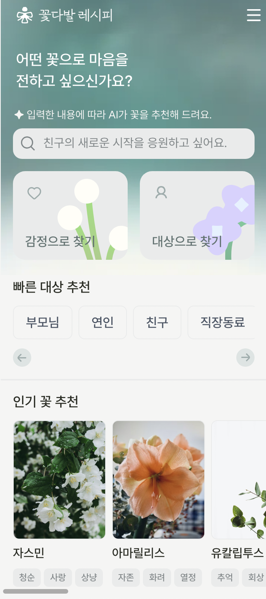
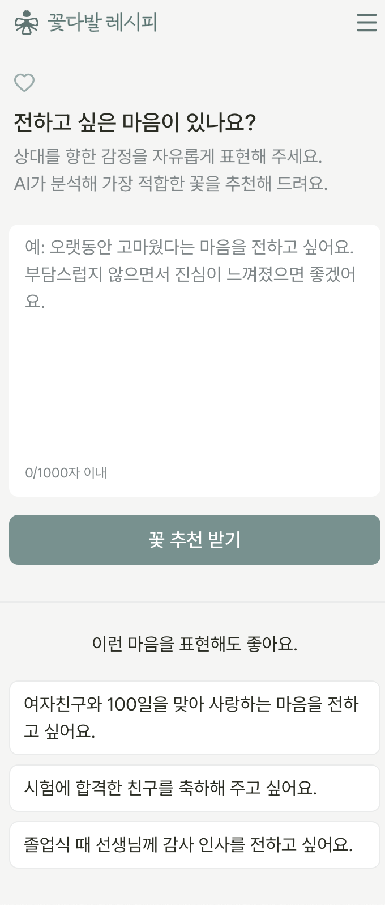
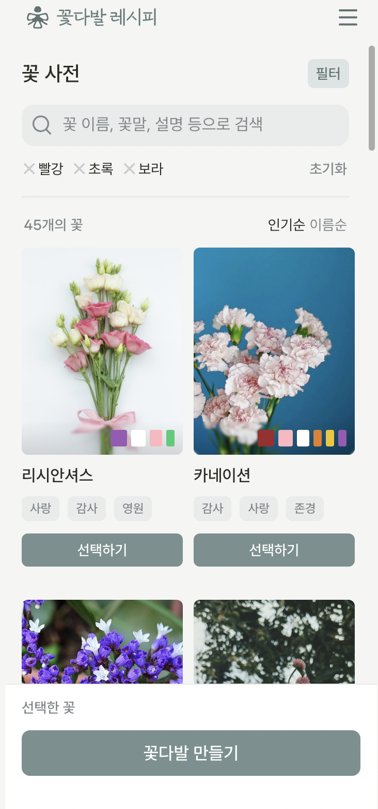

# 🌸 꽃다발 레시피

> AI가 감정과 상황에 맞는 꽃을 추천하고, 나만의 꽃다발을 직접 만들어볼 수 있는 웹 서비스

**Preview 배포** → [https://preview-bouquet-recipe.leeyeah8245.workers.dev](https://preview-bouquet-recipe.leeyeah8245.workers.dev)
> Production 배포는 2025년 4월 2째주 예정입니다.

> 원본 레포지토리는 private organization으로 관리되며, 본 레포지토리는 포트폴리오 공개용 fork입니다.

---

## 📸 화면 구성

| 메인 | AI 프롬프트 |
|:---:|:---:|
|  |  |

| 꽃 사전 | 꽃 상세 |
|:---:|:---:|
|  |  |

---

## 👥 팀 구성

| 역할 | 인원 |
|------|------|
| 프론트엔드 | 1명 (본인) |
| 백엔드 | 1명 |
| 디자인 | 1명 |

총 **3인 개발** 프로젝트로, 본인은 프론트엔드 전체를 담당하였습니다.

---

## ✨ 주요 기능

### 🤖 AI 꽃 추천
- **감정으로 찾기**: 현재 감정이나 전하고 싶은 마음을 자유롭게 입력하면 AI가 어울리는 꽃을 추천
- **대상으로 찾기**: 선물할 대상과 상황을 설명하면 그에 맞는 꽃 조합을 추천
- OpenAI API를 활용한 자연어 분석 및 꽃 추천 결과 반환
- 로딩 중 분석 모달, 최소 10자 입력 유효성 검사 등 UX 세부 처리 포함

### ⚡ 빠른 추천
- 대상(친구, 연인, 부모님 등) + 상황(생일, 기념일, 졸업 등) 조합을 선택하면 프리셋 기반 추천 즉시 제공
- 로그인 없이도 이용 가능

### 📖 꽃 사전
- 60여 종의 꽃 정보 제공 (꽃말, 관리법, 개화 시기, 유사 꽃 등)
- 색상 필터, 계절 필터, 키워드 검색 기능
- Next.js **Parallel Routes (@modal)** 패턴으로 목록에서 상세 정보를 모달로 즉시 표시
- 좋아요(찜) 기능

### 💐 꽃다발 만들기
- 꽃 사전에서 원하는 꽃을 선택해 직접 꽃다발 구성
- 포장지 선택, 꽃다발 제목/메시지 작성
- **인터랙티브 미리보기 캔버스**: 꽃 아이콘을 드래그하여 배치하고 색상을 직접 변경할 수 있는 시각적 편집 기능
- 완성한 꽃다발 저장 및 마이페이지에서 관리

### 👤 마이페이지
- 저장한 꽃다발 목록 조회 / 수정 / 삭제 (단건 및 다중 삭제)
- 좋아요한 꽃 목록 확인
- 프로필 편집 및 회원 탈퇴

### 🔑 인증
- 소셜 로그인 (Apple, Kakao 등) — Supabase OAuth 기반
- 비로그인 상태에서 AI 추천 시도 시 로그인 안내 모달 표시

### 🪙 토큰(Wallet) 시스템
- AI 추천 기능은 토큰을 소진하여 사용
- 잔액 조회 API 및 사용 내역 API 제공

---

## 🛠 기술 스택

### Core
| 기술 | 버전 |
|------|------|
| **Next.js** | 16 |
| **React** | 19 |
| **TypeScript** | ^5 |

### Styling
| 기술 | 버전 |
|------|------|
| **Tailwind CSS** | ^4 |

### 상태 관리
| 기술 | 버전 |
|------|------|
| **TanStack Query** | ^5 |
| **Jotai** | ^2 |

### Backend & DB
| 기술 | 버전 |
|------|------|
| **Supabase** | ^2 |
| **OpenAI SDK** | ^6 |
| **Axios** | ^1 |

### Infra & Deploy
- **Cloudflare Workers** (OpenNext)
- **pnpm**

### DX
- **Swagger** (next-swagger-doc)
- **ESLint**

---

## 🏗 아키텍처 & 기술적 특징

### Feature-Sliced Design (FSD)
`entities/`, `features/`, `shared/` 계층 구조를 적용하여 관심사를 분리하고 컴포넌트 재사용성을 높였습니다.

```
src/
├── app/          # Next.js App Router (pages, layouts, API routes)
├── entities/     # 비즈니스 도메인 단위 (flower, user, occasion)
├── features/     # 사용자 인터랙션 단위 (auth, like, select-flower)
└── shared/       # 공통 UI, 유틸, 훅, 모델
```

### Next.js Parallel Routes (@modal)
꽃 사전 목록 페이지에서 상세 정보를 볼 때, URL을 유지하면서 모달 형태로 상세 페이지를 오버레이하는 패턴을 적용했습니다. (`@modal` 슬롯 활용)

### Event Hub 패턴
부모-자식 컴포넌트 간 복잡한 이벤트 전달을 `eventHub` 객체(mutable ref 기반)로 관리하여 불필요한 리렌더링 없이 자식 컴포넌트의 메서드를 호출할 수 있도록 구현했습니다.

### 인터랙티브 꽃다발 캔버스
드래그 앤 드롭으로 SVG 꽃 아이콘을 캔버스 위에 자유롭게 배치하고, 선택한 꽃의 색상을 실시간으로 변경할 수 있는 커스텀 인터랙션을 Pointer Events API로 구현했습니다.

### Cloudflare Workers 배포
`@opennextjs/cloudflare`를 활용해 Next.js 앱을 Cloudflare의 엣지 네트워크(V8 Workers 런타임)에서 실행합니다.

---

## 🚀 로컬 실행

```bash
# 패키지 설치
pnpm install

# 개발 서버 실행
pnpm dev
```

> 환경 변수 설정 필요(._env 참조)
